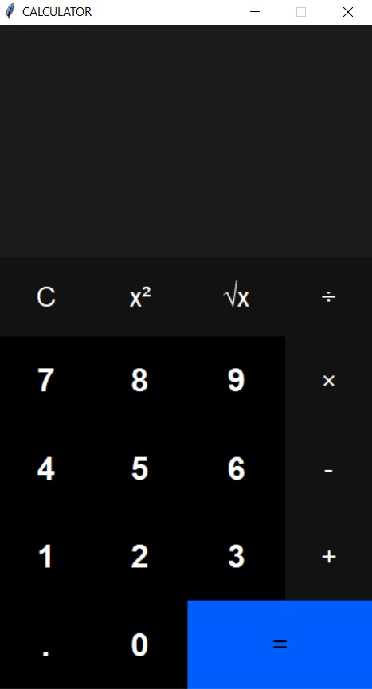

# <div align="center"><a href="https://calculator.yoshitha.tk/"><b><i>WELCOME TO MY CALCULATOR WEBSITE</i></b></a></div>

# <div align="center"></div>

- This Github repository explores the website of a Basic Calculator made by Yoshitha Rathnayak (ME).
- This website gives a preview of my Calculator. 
- The link for downloading the Calculator app is also available on the website.
- The programming languages used to build this website are- HTML, CSS and BOOTSTRAP.

<a href="https://www.w3schools.com/html/"><a> 
<a href="https://www.w3schools.com/css/"><a>
 <a href="https://www.w3schools.com/bootstrap/"><a>

Available at : <b><i>[https://calculator.yoshitha.tk/](https://calculator.yoshitha.tk/)</i></b>


## Features
This is a basic everyday Calculator with following features:
- Basic Operations like Addition, Subtraction, Multiplication and Division can be done.
- Operations to calculate the square or square root of a number can also be performed.
- Supports decimal values.

 <div >
<p>You wanna see the application, don't you?</p>
</div>


# Run Locally

- Clone your forked repository
  ```
  git clone https://github.com/YOUR-USERNAME/CALCULATOR-WEBSITE
  ```

  
## 🚀 About Me
Hii, I am _**Yoshitha Rathnayake**_. This is one of 
the many websites which I have made.
 
Being an Open Source Contributor:
- I am proficient in Web and Game Development.
- I specialize in Photo and Video Editing.
- I excel in both UI and UX Designing. 
- I am also adept at Graphic Designing.


## 🔗 Link
[](https://github.com/YoshithaRathnayake)
[](https://gitlab.com/YoshithaRathnayake)
[](https://twitter.com/Yoshitha2008)


## Contributing

Contributions are always welcome!

If you run into an issue, we would be very happy if you would first create an issue and get it assigned.

After having been assigned, open your Pull Requests.

The Pull Requests will be reviewed and merged accordingly.


